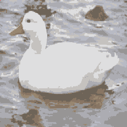

# Patito cuac cuac
hello everyone its me patito cuac cuac<br>
[aquel](https://www.youtube.com/watch?v=sqgSKgznvFI) meme solo que ahora es real<br>

## Construir
para este port necesitaras devkitpro con gba-dev y butano, luego ejecuta
```bash
  make
```
luego cargas el archivo gba en una flashcart y ya :P
## Creditos
La imagen original del pato viene de wikipedia y contiene la licencia de Creative Commons Genérica de Atribución/Compartir-Igual 3.0.